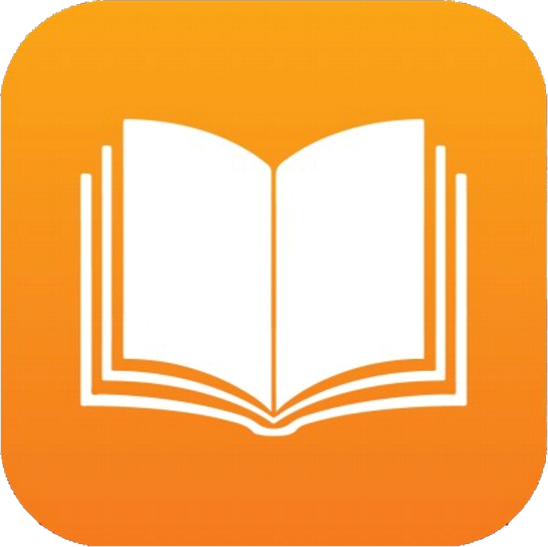

---

* 101 Ready-to-Use Excel Formulas - Michael Alexander
* A Byte of Python - Swaroop C H
* Automate the Boring Stuff with Python
* Beginning Game Programming for Teens with Python
* Beginning PHP And MySQL From Novice To Professional 4th Edition
* Build a Python Flask App on Glitch
* Build Your Own Database Driven Website using PHP & MySQL - Kevin Yank
* Chrome DevTools Keyboard Shortcuts
* Coding & English Lit- Natural Language Processing in Python
* Coding & World Language Lit- Analyzing Dante’s Inferno with Python NLTK
* Coding for Kids - Tynker
* Computer Coding Python Projects for Kids
* Computer Games and ESL Learning
* Core Python Applications Programming - Wesley J. Chun
* Cracking Codes with Python - Al Sweigart
* Deep Learning with Python - A Hands-on Introduction
* Developer Productivity Engineering
* DroidScript Tutorials - DroidScript
* Effective Python - 59 Specific Ways to Write Better Effective Software Development Series - Brett Slatkin
* Excel 2019 Power Programming with VBA - Michael Alexander
* Expert PHP and MySQL - Marc Rochkind
* Fluent Python - Luciano Ramalho
* Hacking Secret Ciphers with Python - Al Sweigart
* High Availability MySQL Cookbook Over 50 Simple But Incredibly Effective Recipes
* How to Add Background Music to Your Web Page
* How to Think Like a Computer Scientist- Learning with Python 2nd Edition
* Human-centric Computing and Information Sciences
* Invent Your Own Games with Python 2nd Edition
* JavaScript MDN Web Docs 2019
* Learning PHP, MySQL & JavaScript - Robin Nixon
* Live video streaming with open source Video.js
* Mastering PHPmyadmin
* MySQL and PHP
* MySQL Cookbook - Paul DuBois
* MySQL Cookbook - Solutions for Database Developers and Administrators - DuBois, Paul
* MySQL for Python - Albert Lukaszewski
* MySQL for the Internet of Things - Charles Bell
* MySQL Language Reference
* PHP & MySQL - Novice to Ninja, 6th Edition
* PHP and MySQL for Dynamic Web Sites - Larry Ullman
* PHP, MySQL, & JavaScript All-in-One For Dummies
* PHP, MySQL, JavaScript & HTML5 All-In-One For Dummies - Steven Suehring, Janet Valade
* PHP5 and MySQL Bible - Tim Converse, Joyce Park, Clark Morgan
* PostgreSQL- Up and Running 3rd Edition - Regina O. Obe
* Practical PHP and MySQL Website Databases - A Simplified Approach - Adrian W. West
* Practical SQL - Anthony DeBarros
* Pro Git Book
* Python for Everybody - Charles Severance
* Python IDEs and Code Editors (Guide)
* Ruby Installer for Windows
* Scratch Programming Playground
* Scrum - The Art of Doing Twice the Work in Half the Time - Jeff Sutherland
* Smarter Way to Learn JavaScript- The new approach thchnology to cut your effort in half, A - Myers
* Some Simple & Amazing JavaScript Tricks
* The easy way to install Ruby on Windows
* The Linux Command Line - A Complete Introduction - William Shotts

---
